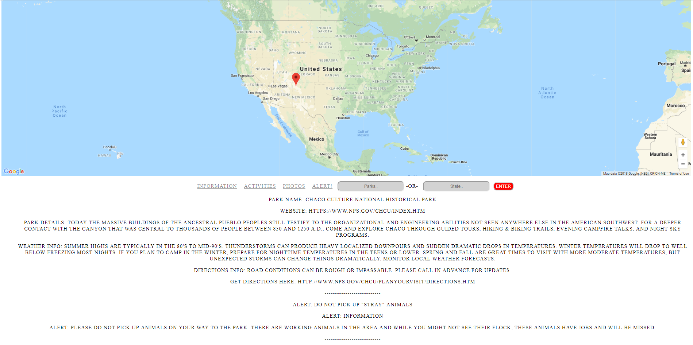

# Park finder

<h3>UCI Coding bootcamp project #2</h3>
<h5>It allows the user to search nation wide for park either by park name or location. It then populates the parks with markers on a google map with an info window. When you click on that marker is populates all kinds of useful information that is pulled from the National Parks API and displayed below</h5>
<h4>Technologies include:</h4>
<ul>
  <li>HTML
  <li>CSS
  <li>JavaScript
  <li>ajax
  <li>Google maps API
  <li>National Parks API
    
 
